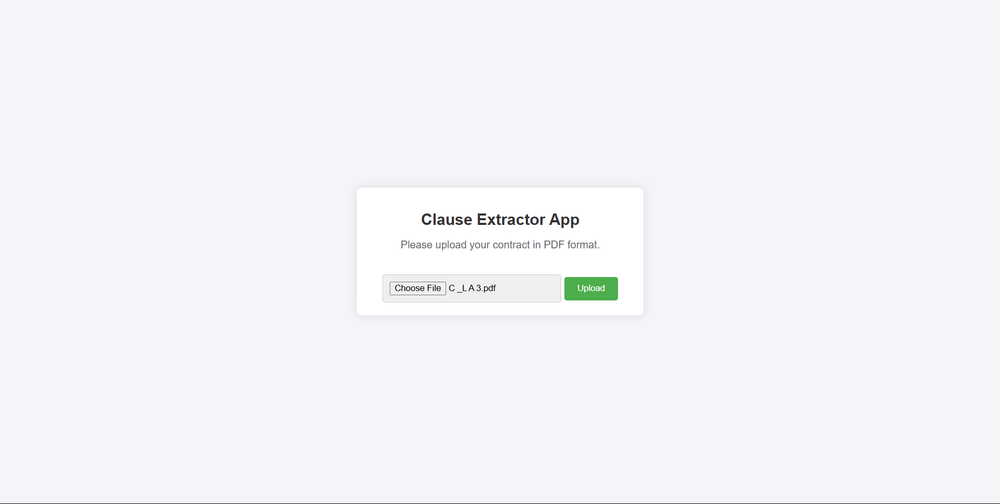
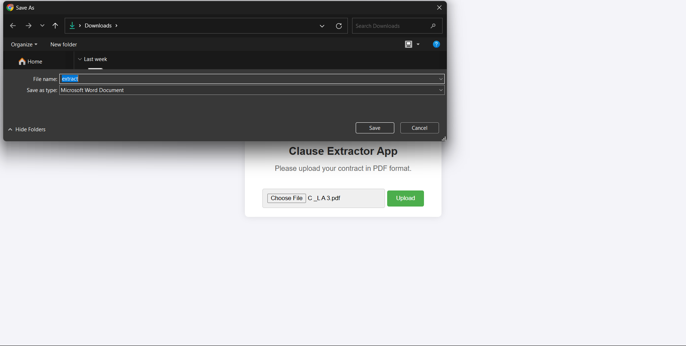

# Clause Extractor Project

This project is a **Clause Extractor Application** designed to extract document types and clauses from legal documents, such as contracts, agreements, and terms of service. The application processes PDF files, identifies the document type, and extracts clause names and their content. It generates a downloadable `.docx` file containing the extracted information in a structured format.

This project was developed under the guidance of **Dr. (Prof.) Neelesh S. Upadhye**, Professor in the Department of Mathematics, **IIT Madras**.

---

## Features

- **PDF Upload**: Upload legal documents in PDF format.
- **Clause Extraction**: Extracts clause names and their content from the uploaded document.
- **Document Type Identification**: Automatically identifies the type of document (e.g., Contract, Agreement, etc.).
- **Downloadable Output**: Generates a `.docx` file with the extracted information.
- **Interactive Web Interface**: Simple and user-friendly interface for uploading files and downloading results.

---

## How It Works

1. **Upload a PDF**: The user uploads a legal document in PDF format through the web interface.
2. **Text Extraction**: The application extracts text from the PDF using `PyPDF2`.
3. **Clause Identification**: Using a pre-defined prompt and the Groq API, the application identifies clause names and their content.
4. **Document Type Detection**: The application determines the document type using similarity search in a vector store.
5. **Generate Output**: The extracted information is saved in a `.docx` file, which the user can download.

## Screenshots

1. **Application UI**: This is how the application looks when it opens.

   

2. **Upload Document**: Upload the document in PDF format and click the upload button.

   

3. **Save Extracted File**: Once the extraction is done, it automatically prompts to save the file as `extract.docx`.

   

## Installation

To set up the project locally, follow these steps:

1. Clone the repository:

   ```bash
   git clone https://github.com/your-repo/clause-extractor-project.git
   cd clause-extractor-project
   ```

2. Create a virtual environment and activate it:

   ```bash
   python -m venv env
   .\env\Scripts\activate  # On Windows
   ```

3. Install the required dependencies:

   ```bash
   pip install -r requirements.txt
   ```

4. Add your Groq API key to the config.yaml file:

   ```yaml
   GROQ_API_KEY: "your_groq_api_key_here"
   ```

5. Run the application:

   ```bash
   python app.py
   ```

6. Open your browser and navigate to:
   ```
   http://127.0.0.1:5000/
   ```

## Project Structure

clause-extractor-project/
│
├── [app.py] # Main Flask application
├── [vector_store.py] # Vector store creation and loading logic
├── templates/
│ └── [index.html] # HTML template for the web interface
├── static/
│ └── [style.css] # CSS for styling the web interface
├── documents/ # Directory for uploaded and processed documents
├── [config.yaml] # Configuration file for API keys
├── [requirements.txt] # Python dependencies
├── [prompt.txt] # Prompt used for clause extraction
├── .gitignore # Git ignore file
├── images/ # Added images for documentation
└── README.md # Project documentation

## Technologies Used

- **Python:** Core programming language.
- **Flask:** Web framework for building the application.
- **PyPDF2:** Library for extracting text from PDF files.
- **Groq API:** Used for clause extraction and document type identification.
- **FAISS:** Vector store for similarity search.
- **HuggingFace Embeddings:** For embedding text into vector space.
- **python-docx:** For generating `.docx` files.

## Configuration

The application requires a `config.yaml` file with the following structure:

```yaml
GROQ_API_KEY: "your_groq_api_key_here"
```

Replace `your_groq_api_key_here` with your actual Groq API key.

## Usage 

1. Start the application by running app.py.
2. Open the web interface in your browser.
3. Upload a PDF document.
4. Wait for the application to process the file.
5. Download the .docx file containing the extracted clauses and document type.

## Acknowledgments

This project was developed under the supervision of **Dr. (Prof.) Neelesh S. Upadhye**, Professor in the Department of Mathematics, **IIT Madras**. His guidance and expertise were instrumental in the successful completion of this project.

I am also deeply thankful to **Legalbook** company for allowing me to create this product for them. They provided the necessary data for the database and documents for testing and verification. 

Special thanks to **Radhika Deshpande**, the CEO of Legalbook Company, and **Sayali Dandavate**, the Product Manager, for their constant support and encouragement throughout the development of this project.

## Contact

For any queries or suggestions, please feel free to reach out:

- **Email:** brpuneet898@gmail.com
- **Website:** brpuneet898.github.io